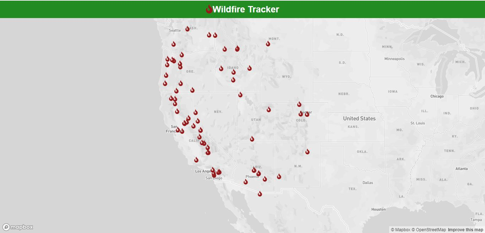

This web app tracks wildfires across the world.
Nasa EONET(Earth Observatory Natural Event Tracker) API is used to obtain wildfire data.
Mapbox is used for plotting the wirefires on the map

1. Run "npm install" in the extracted folder
2. Run "npm start" to view the project
